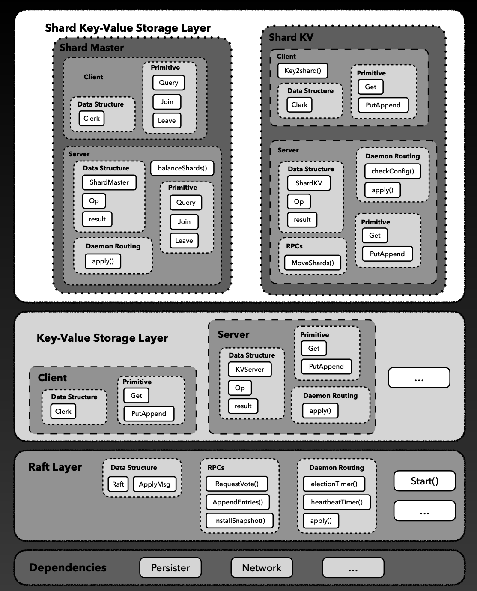
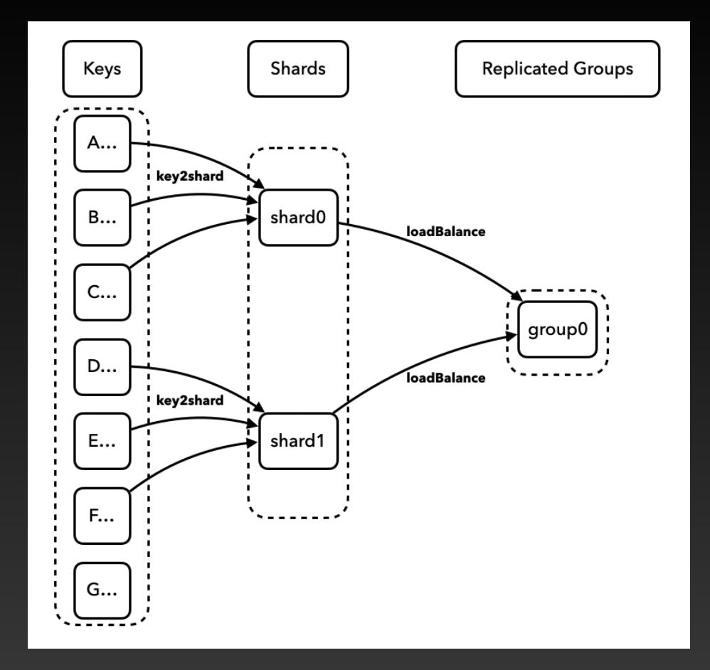
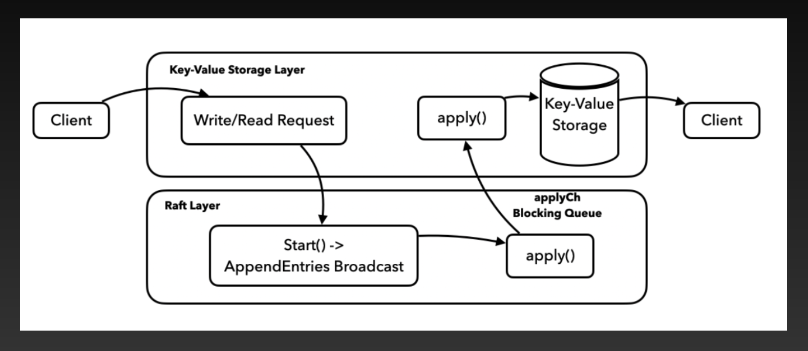

# Distributed System Course Lab Assignments - MIT 6.824

Welcome to my forked repository of the MIT 6.824 Distributed System course lab assignments! In this repository, you'll find all the completed lab assignments for the course. This course provided an in-depth understanding of distributed systems, and I had an incredible learning experience while working on these labs.

## Architecture
 

    

## Load Balance
 

    

## Instruction Flow
 

    

## Lab 1

**Lab 1:** Build a MapReduce system. This lab involves implementing a worker process that calls application Map and Reduce functions, handles reading and writing files, and a coordinator process that hands out tasks to workers and copes with failed workers.

- [Link to Lab 1](https://pdos.csail.mit.edu/6.824/labs/lab-mr.html)

## Lab 2

**Lab 2:** Implement Raft, a replicated state machine protocol. This lab involves building a fault-tolerant key/value storage system using Raft as the foundation. The lab includes saving persistent state, recovering after node failures, and ensuring that replicas maintain the same log contents. Your Raft implementation should support an indefinite sequence of numbered commands, also known as log entries, which will be eventually committed and executed by the key/value service.

- [Link to Lab 2](https://pdos.csail.mit.edu/6.824/labs/lab-raft.html)

## Lab 3

**Lab 3:** Build a fault-tolerant key/value storage service using your Raft library from Lab 2. The key/value service will be a replicated state machine, consisting of several key/value servers that use Raft for replication. The service should continue to process client requests as long as a majority of the servers are alive and can communicate, in spite of other failures or network partitions.

- [Link to Lab 3](https://pdos.csail.mit.edu/6.824/labs/lab-kvraft.html)

## Lab 4

**Lab 4:** Build a key/value storage system that "shards," or partitions, the keys over a set of replica groups. The sharded key/value store will have two main components: a set of replica groups and a "shard controller." The shard controller decides which replica group should serve each shard, and clients consult the shard controller to find the replica group for a key.

- [Link to Lab 4](https://pdos.csail.mit.edu/6.824/labs/lab-shard.html)